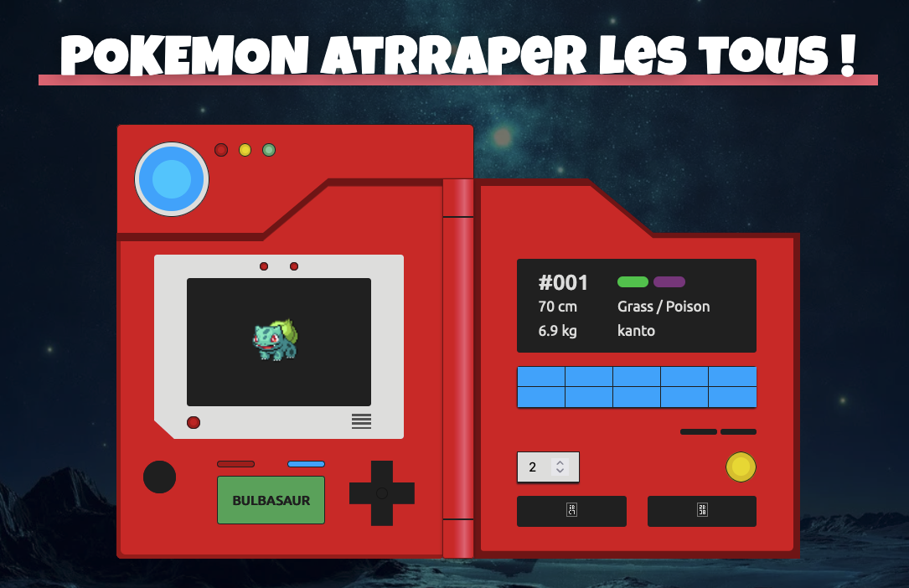

#Pokedex en HTML CSS Javascript 

Le but est de créer  un pokedex en utilisant un script JS en incluant des images de fond par type de Pokemon avec une API
L'API Pokémon fournit des données sur les Pokémon. Vous pouvez en savoir plus sur l'API en suivant ce lien : [Pokémon API](https://pokeapi.co/api/v2/pokemon).

Ce projet a été refait par moi meme suite à un tutoriel youtube 
